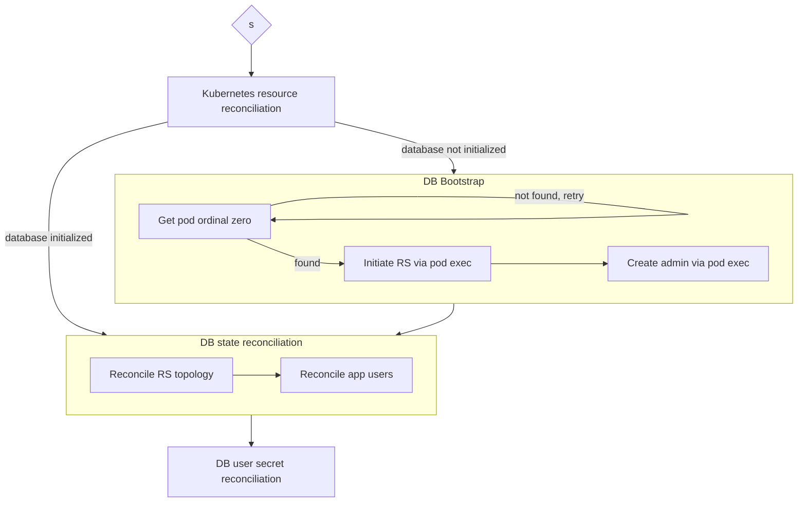

# SingleTenantMongoDB Controller

A simple Kubernetes Controller for managing single-tenant MongoDB replica sets.

It automates deployment, replica set initialization, topology reconciliation, and application user management so that applications can consume MongoDB through a simple Custom Resource rather than manually managing StatefulSets and replica set administration.

## Features

- Deploys MongoDB StatefulSets
- Manages replica set topology
- Bootstraps MongoDB automatically (in container image)
- Reconciles application users
- Rotates passwords
- Generates MongoDB keyfile secrets
- Publishes connection information

## Reconciliation

