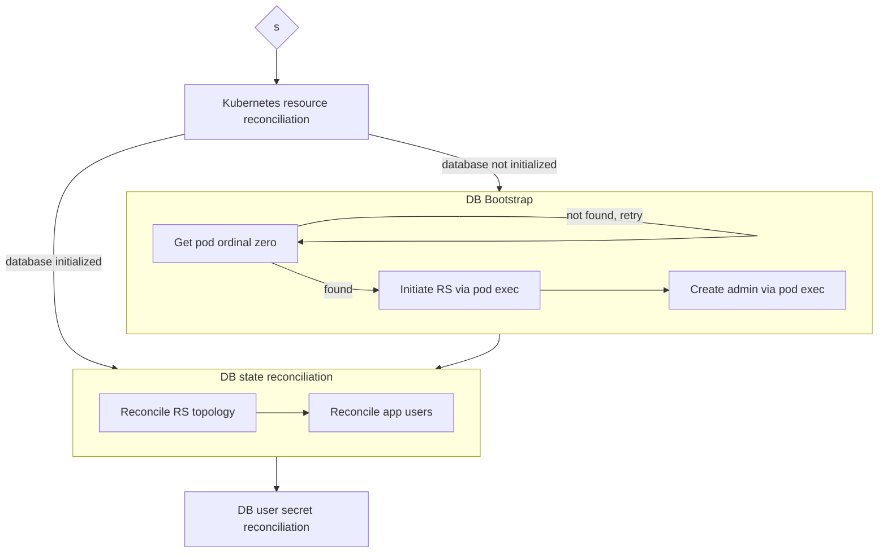

# SingleTenantMongoDB Controller

A simple Kubernetes Controller for managing single-tenant MongoDB replica sets.

It automates deployment, replica set initialization, topology reconciliation, and application user management so that applications can consume MongoDB through a simple Custom Resource rather than manually managing StatefulSets and replica set administration.

## Features

- Deploys MongoDB StatefulSets
- Manages replica set topology
- Bootstraps MongoDB automatically (in container image)
- Reconciles application users
- Rotates passwords
- Generates MongoDB keyfile secrets
- Publishes connection information

## Reconciliation

```mermaid

flowchart TD
    subgraph C[DB Bootstrap]
        CA[Get pod ordinal zero]
        CB[Initiate RS via pod exec]
        CC[Create admin via pod exec]

        CA -- not found, retry --> CA
        CA -- found --> CB
        CB --> CC
    end

    subgraph D[DB state reconciliation]
        DA[Reconcile RS topology]
        DB[Reconcile app users]

        DA --> DB
    end

    A{s}
    B[Kubernetes resource reconciliation]

    E[DB user secret reconciliation]

    A --> B
    B -- database not initialized --> C
    B -- database initialized --> D
    C --> D
    D --> E

```

## CI/CD workflows

### On PR to main

- Run lint check
- Execute unit tests
- Execute e2e tests
- Check CRD version
- Check controller version
    - must have been raised if code has been touched
    - new version MUST result in chart version
- Check chart version
    - must have been raised if templates have been touched
    - `appVersion` MUST match controller version

Not triggered on `.md` only PRs.

### On tag push

- Tag: `mongodb-v*-r*`
    - push DB image to GHCR
- Tag: `controller-v*`
    - push controller image to GHCR
- Tag: `chart-v*`
    - push chart to GHCR

Not triggered on `.md` only pushes.

### On release

- Tag: `mongodb-v*-r*`
    - retag image built from the tagged commit
- Tag: `controller-v*`
    - retag image built from the tagged commit
- Tag: `chart-v*`
    - retag image built from the tagged commit

## Versioning

Chart version follows SemVer.

appVersion matches the controller version.

MongoDB image version follows
<upstream-version>-r<revision>.
