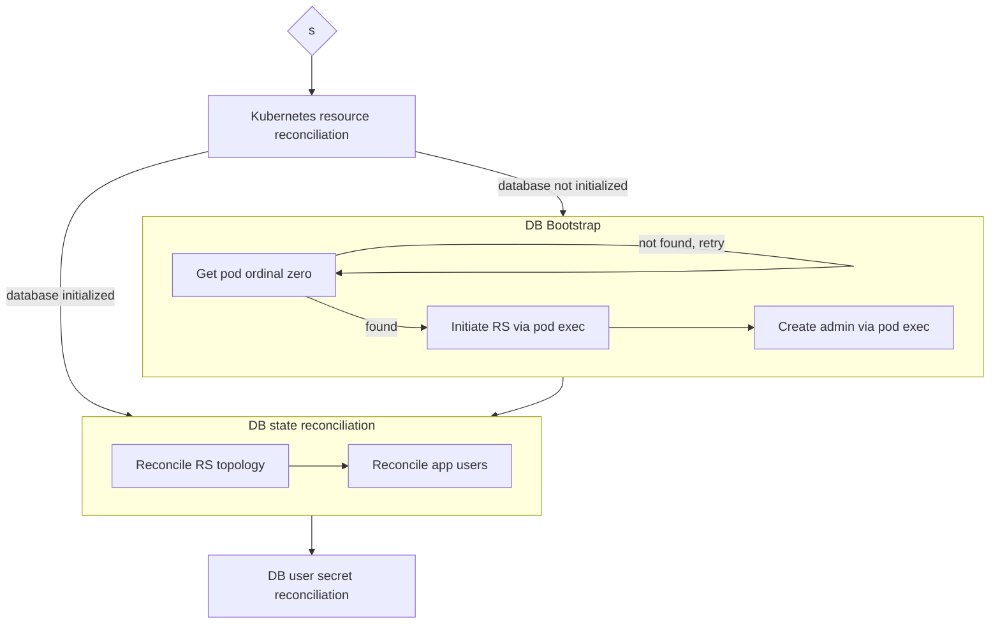

# Architecture

```text
           SingleTenantMongoDB CR
                     |
                     v
              MongoDB Operator
                     |
    +----------------+----------------+
    |                |                |
    v                v                v
StatefulSet       Secrets         ConfigMap
    |
    v
MongoDB Pods
    |
    v
Replica Set
```

- Controller deployment exists in user-defined namespace
- CRDs are installed cluster-wide. Custom Resources may exist in namespaces managed by the operator.
    - Controller manages:
        - STS
        - Svc (headless)
        - CM (connection information for applications)
        - Secret (MongoDB keyfile)

## Reconciliation flow



## Evolution

```mermaid

flowchart TD
  A[Kubernetes templates + single-replica manually managed MongoDB STS]
  B[Kubernetes templates + multiple-replica manually managed MongoDB STS]
  C[Kubernetes templates + MongoDB RS operator]
  D[CRD + hand-written MongoDB controller + RS operator]
  E[CRD + Kubebuilder MongoDB controller + RS operator]

  A -- experimentation -> B
  B -- operational automation -> C
  C -- naive abstraction -> D
  D -- adoption of industry-standard tooling -> E

```

## Future work

- Tighten RBAC so operators only have access to Secrets owned by their managed resources, reducing blast radius in multi-tenant clusters
- Horizontal autoscaling
    - TODO: Investigate autoscaling strategies while considering MongoDB replica set membership changes and stateful workload constraints
- Keyfile rotation

## Current limitations

- Only supports a single application database per MongoDB deployment
- Does not currently implement finalizers for external cleanup
- Does not currently support MongoDB version upgrades
- Does not currently support automated keyfile rotation
- Does not currently expose Prometheus metrics for database health
